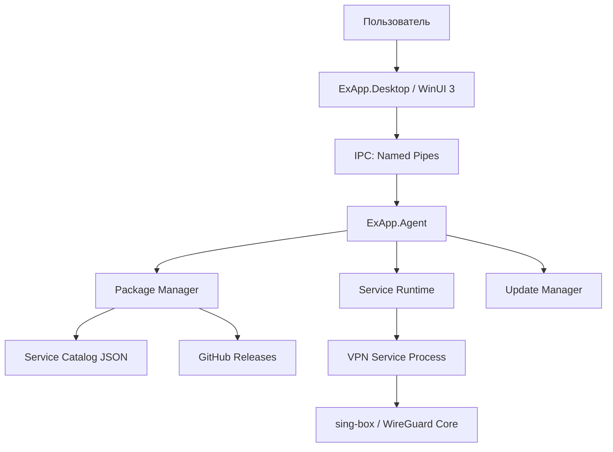

# 02 — Архитектура

## Целевое решение



## Компоненты

### ExApp.Desktop

Назначение:

- WinUI 3 интерфейс;
- список сервисов;
- браузер сервисов;
- настройки;
- tray icon;
- системные уведомления;
- отображение статусов и логов.

Не должен:

- напрямую менять маршруты;
- напрямую запускать VPN core;
- напрямую распаковывать неподписанные пакеты;
- работать постоянно от администратора.

Чеклист:

- [ ] TODO — создать WinUI 3 проект
- [ ] TODO — добавить NavigationView
- [ ] TODO — добавить страницы Services, Service Browser, Settings, Diagnostics
- [ ] TODO — реализовать single instance
- [ ] TODO — реализовать tray behavior
- [ ] TODO — подключить IPC client

### ExApp.Agent

Назначение:

- фоновый runtime;
- управление сервисами;
- установка/удаление/обновление пакетов;
- запуск сервисных процессов;
- мониторинг health;
- работа с privileged operations.

Чеклист:

- [ ] TODO — создать Worker/Console проект
- [ ] TODO — реализовать IPC server
- [ ] TODO — реализовать ServiceRegistry
- [ ] TODO — реализовать ServiceProcessManager
- [ ] TODO — реализовать PackageManager
- [ ] TODO — реализовать DiagnosticsProvider
- [ ] TODO — подготовить режим Windows Service

## Главные архитектурные принципы

### 1. UI не выполняет privileged operations

Все опасные операции идут через Agent.

### 2. Сервисы не загружаются как DLL в Desktop

Каждый сервис — отдельный процесс. Это снижает риск падения всего приложения.

### 3. Бинарники и данные разделены

```text
services/vpn-client/versions/1.0.0/
services/vpn-client/current/
services/vpn-client/data/
services/vpn-client/logs/
```

### 4. Любая установка идёт через staging

Нельзя распаковывать пакет сразу в `current`.

### 5. Подпись и хэш обязательны

Даже если первый MVP будет использовать упрощённую проверку, архитектурно место под подпись должно быть с первого дня.

### 6. Подписки VPN не логируются

Subscription URL и ключи считаются секретами.
