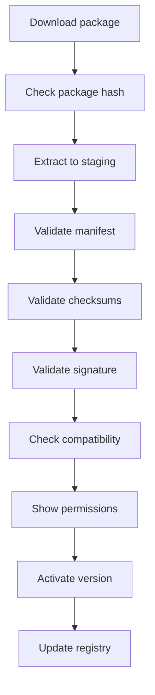

# 06 — Package Manager Spec

## Цель

Package Manager отвечает за установку, обновление, проверку и удаление сервисов.

## Формат пакета

Расширение:

```text
.svcpkg
```

Физически это zip-архив:

```text
vpn-client-1.0.0-win-x64.svcpkg
├── service.manifest.json
├── checksums.json
├── signature.sig
├── icon.png
├── bin/
│   ├── ExApp.Service.Vpn.exe
│   └── dependencies...
├── ui/
│   └── service-ui.json
└── assets/
```

## checksums.json

```json
{
  "algorithm": "sha256",
  "files": [
    {
      "path": "service.manifest.json",
      "sha256": "..."
    },
    {
      "path": "bin/ExApp.Service.Vpn.exe",
      "sha256": "..."
    }
  ]
}
```

## Установка



## Папки

```text
%LocalAppData%/ExApp/
├── services/
│   └── vpn-client/
│       ├── current/
│       ├── versions/
│       │   ├── 1.0.0/
│       │   └── 1.0.1/
│       ├── data/
│       ├── logs/
│       └── package-state.json
├── packages/
│   ├── cache/
│   └── staging/
└── registry/
    └── installed-services.json
```

## Atomic activation

Windows symlink может требовать отдельной обработки прав, поэтому лучше не зависеть от symlink в MVP. Использовать pointer file:

```json
{
  "currentVersion": "1.0.1",
  "previousVersion": "1.0.0",
  "state": "installed"
}
```

Agent резолвит current так:

```text
services/<id>/versions/<currentVersion>/
```

## Install checklist

- [ ] TODO — скачать пакет во временный файл
- [ ] TODO — проверить expected package sha256 из catalog
- [ ] TODO — распаковать в staging
- [ ] TODO — проверить наличие `service.manifest.json`
- [ ] TODO — проверить schema manifest
- [ ] TODO — проверить `id`, `version`, `platform`, `architecture`
- [ ] TODO — проверить `minAppVersion`
- [ ] TODO — проверить `minAgentVersion`
- [ ] TODO — проверить checksums всех файлов
- [ ] TODO — проверить подпись
- [ ] TODO — показать permissions
- [ ] TODO — скопировать в `versions/<version>`
- [ ] TODO — обновить `package-state.json`
- [ ] TODO — обновить `installed-services.json`
- [ ] TODO — очистить staging

## Update checklist

- [ ] TODO — проверить, что сервис установлен
- [ ] TODO — проверить доступную версию
- [ ] TODO — остановить сервис, если он запущен
- [ ] TODO — скачать новую версию
- [ ] TODO — установить в staging
- [ ] TODO — сохранить previousVersion
- [ ] TODO — переключить currentVersion
- [ ] TODO — запустить service health check
- [ ] TODO — при ошибке вернуть previousVersion
- [ ] TODO — при успехе удалить старые версии по retention policy

## Uninstall checklist

- [ ] TODO — остановить сервис
- [ ] TODO — удалить binaries
- [ ] TODO — удалить package state
- [ ] TODO — удалить запись из registry
- [ ] TODO — спросить пользователя о data deletion
- [ ] TODO — если пользователь согласен, удалить `data/`
- [ ] TODO — если пользователь согласен, удалить secrets
- [ ] TODO — сохранить uninstall log

## Required tests

- [ ] TODO — valid package installs
- [ ] TODO — invalid manifest rejected
- [ ] TODO — wrong sha256 rejected
- [ ] TODO — incompatible app version rejected
- [ ] TODO — update rollback works
- [ ] TODO — uninstall preserves data
- [ ] TODO — uninstall deletes data when requested
