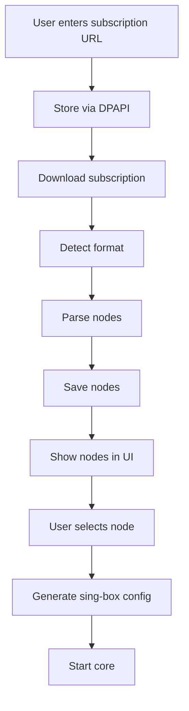

# 07 — VPN Service Spec

## Цель

Первый устанавливаемый сервис — **VPN Client**. Он доказывает, что платформа умеет скачивать, устанавливать, запускать и обновлять сложный фоновый сервис.

## MVP scope

В первый MVP входит:

- [ ] TODO — установка VPN service из Service Browser
- [ ] TODO — запуск VPN core со статическим config
- [ ] TODO — остановка VPN core
- [ ] TODO — статус в UI
- [ ] TODO — логи в UI
- [ ] TODO — добавление subscription URL
- [ ] TODO — поддержка одного формата подписки
- [ ] TODO — выбор сервера
- [ ] TODO — генерация config
- [ ] TODO — redaction секретов

Не входит:

- [ ] TODO — полноценный kill switch
- [ ] TODO — split tunneling
- [ ] TODO — поддержка всех протоколов
- [ ] TODO — аккаунты
- [ ] TODO — платные тарифы
- [ ] TODO — mobile sync

## VPN core

Рекомендуемый первый core:

```text
sing-box
```

Причина: subscription links чаще относятся к proxy/VPN-экосистеме с VLESS/VMess/Trojan/Shadowsocks/etc. WireGuard оставить как отдельный профильный режим позже.

## VPN service package

```text
vpn-client-1.0.0-win-x64.svcpkg
├── service.manifest.json
├── checksums.json
├── signature.sig
├── bin/
│   ├── MyApp.Service.Vpn.exe
│   ├── sing-box.exe
│   └── dependencies...
├── ui/
│   └── service-ui.json
└── assets/
    └── icon.png
```

## VPN commands

| Command | Назначение |
|---|---|
| `vpn.subscription.add` | сохранить subscription URL |
| `vpn.subscription.refresh` | скачать и обновить подписку |
| `vpn.nodes.list` | получить список серверов |
| `vpn.node.select` | выбрать node |
| `vpn.start` | подключиться |
| `vpn.stop` | отключиться |
| `vpn.status` | получить статус |
| `vpn.logs` | получить логи |
| `vpn.config.validate` | проверить config |

## Subscription flow



## States

- [ ] TODO — `notConfigured`
- [ ] TODO — `subscriptionInvalid`
- [ ] TODO — `ready`
- [ ] TODO — `connecting`
- [ ] TODO — `connected`
- [ ] TODO — `disconnecting`
- [ ] TODO — `disconnected`
- [ ] TODO — `error`

## Secret handling

Нельзя логировать:

- [ ] TODO — полный subscription URL
- [ ] TODO — token
- [ ] TODO — private key
- [ ] TODO — UUID
- [ ] TODO — password
- [ ] TODO — полный generated config

Логи должны использовать redaction:

```text
Subscription: https://example.com/sub/***
Node: Germany 01
Error: connection timeout
```

## MVP subscription format strategy

Рекомендация:

- [ ] TODO — сначала реализовать собственный test JSON format
- [ ] TODO — затем добавить Clash YAML
- [ ] TODO — затем добавить base64 subscription
- [ ] TODO — затем добавить VLESS/Trojan/etc parsers

## Admin rights

Правильная модель:

```text
Desktop UI: обычный пользователь
Agent: privileged operations
VPN Core: запускается Agent'ом
```

Чеклист:

- [ ] TODO — не запускать весь UI от администратора
- [ ] TODO — показывать `NeedsPermission`
- [ ] TODO — Agent должен уметь выполнять elevated operations
- [ ] TODO — обработать отказ пользователя в elevation
- [ ] TODO — корректно отключать VPN при завершении сервиса

## Future VPN features

- [ ] TODO — latency check
- [ ] TODO — auto select fastest node
- [ ] TODO — auto reconnect
- [ ] TODO — connect on startup
- [ ] TODO — DNS settings
- [ ] TODO — basic DNS leak prevention
- [ ] TODO — experimental kill switch
- [ ] TODO — split tunneling
- [ ] TODO — traffic stats
- [ ] TODO — per-app routing
- [ ] TODO — WireGuard profile import
