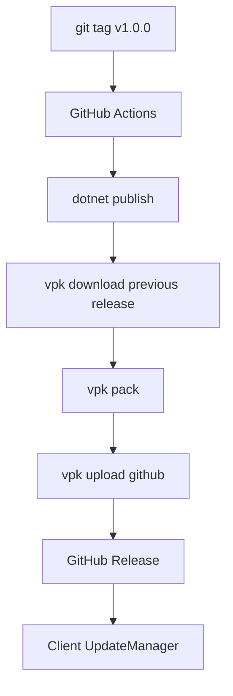
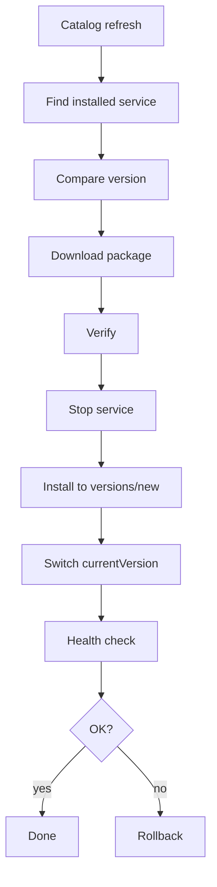

# 09 — Update & Release Plan

## Цель

Релизы приложения и сервисов должны идти через GitHub Releases, но пользователь должен получать обновления удобно и безопасно.

## Уровни обновлений

```text
Level 1: ExApp Desktop + Agent
Level 2: Installed Services
Level 3: Service Catalog
```

## App updates

Реализован собственный внешний `ExApp.Updater` + GitHub Releases. Desktop и Agent
поставляются одним пакетом, проверяются по SHA-256 и заменяются только после создания backup.

Поток:



## App release checklist

- [x] DONE — добавить update check
- [x] DONE — добавить stable channel
- [x] DONE — добавить beta channel
- [x] DONE — настроить GitHub Actions
- [x] DONE — генерировать полный ZIP package
- [x] DONE — проверять SHA-256 и размер
- [x] DONE — обновлять Desktop и Agent атомарно
- [x] DONE — создавать backup и выполнять rollback
- [x] DONE — публиковать GitHub Release
- [ ] TODO — добавить подписанный installer
- [ ] TODO — добавить delta packages при необходимости

## Service updates

Service updates не должны зависеть от обновления всего приложения.

Поток:



## Service release checklist

- [x] DONE — собрать service binaries
- [x] DONE — создать `.svcpkg`
- [x] DONE — сгенерировать checksums
- [ ] TODO — подписать package
- [x] DONE — загрузить в GitHub Releases
- [x] DONE — обновить `services.stable.json`
- [x] DONE — проверить catalog metadata
- [ ] TODO — подписать catalog
- [x] DONE — опубликовать catalog

## Channels

Сразу заложить:

- [x] DONE — `stable`
- [x] DONE — `beta` для приложения
- [ ] TODO — `dev`

## GitHub repositories

Рекомендуемый вариант:

```text
github.com/<owner>/exapp
  - основное приложение
  - исходники
  - app releases

github.com/<owner>/exapp-services
  - service packages
  - service releases

github.com/<owner>/exapp-catalog
  - services.stable.json
  - services.beta.json
```

Для MVP можно всё держать в одном mono-repo, но логически разделить папки.

## Versioning

Использовать SemVer:

```text
App:     0.1.0
Agent:   0.1.0
Service: 0.1.0
API:     1
Catalog: 1
```

## Release rules

- [ ] TODO — каждый app release имеет changelog
- [ ] TODO — каждый service release имеет changelog
- [ ] TODO — нельзя перезаписывать опубликованные версии
- [ ] TODO — нельзя менять package без изменения version
- [ ] TODO — нельзя публиковать package без sha256
- [ ] TODO — нельзя публиковать unsigned package в production
- [ ] TODO — rollback должен быть возможен минимум на одну версию назад

## Update UI

- [x] DONE — текущая версия приложения
- [x] DONE — текущая версия Agent
- [x] DONE — список установленных сервисов и версий
- [x] DONE — кнопка “Проверить обновления”
- [x] DONE — automatic update check toggle
- [x] DONE — channel selector
- [x] DONE — update history
- [ ] TODO — restart required state
