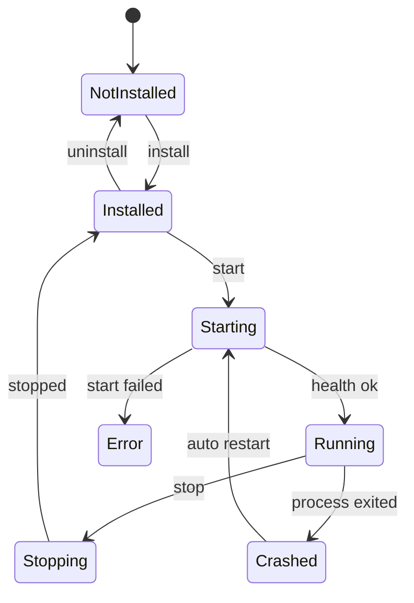

# 05 — Service Platform Spec

## Service model

Каждый сервис — отдельный устанавливаемый пакет и отдельный процесс.

```text
ExApp.Agent
└── starts/stops
    └── services/<service-id>/current/bin/<service-exe>
```

## Service lifecycle



## Required service commands

| Command | Назначение |
|---|---|
| `service.handshake` | проверить совместимость API |
| `service.start` | запустить основную функцию |
| `service.stop` | остановить основную функцию |
| `service.status` | получить статус |
| `service.health` | health check |
| `service.logs` | получить логи |
| `service.configure` | обновить конфигурацию |
| `service.shutdown` | завершить процесс |

## Service status model

```json
{
  "serviceId": "vpn-client",
  "version": "1.0.0",
  "state": "running",
  "health": "ok",
  "message": "Connected",
  "lastError": null,
  "updatedAt": "2026-06-11T12:00:00Z"
}
```

## State values

- [ ] TODO — `notInstalled`
- [ ] TODO — `installed`
- [ ] TODO — `starting`
- [ ] TODO — `running`
- [ ] TODO — `stopping`
- [ ] TODO — `stopped`
- [ ] TODO — `crashed`
- [ ] TODO — `error`
- [ ] TODO — `needsPermission`
- [ ] TODO — `needsRestart`
- [ ] TODO — `updateAvailable`
- [ ] TODO — `updateFailed`

## Service manifest

Файл: `service.manifest.json`

```json
{
  "manifestVersion": 1,
  "id": "vpn-client",
  "name": "VPN Client",
  "description": "VPN-клиент с поддержкой subscription URL.",
  "version": "1.0.0",
  "publisher": {
    "id": "exapp",
    "name": "ExApp"
  },
  "category": "network",
  "platform": "windows",
  "architecture": "x64",
  "apiVersion": 1,
  "minAppVersion": "0.1.0",
  "minAgentVersion": "0.1.0",
  "entry": {
    "type": "process",
    "executable": "bin/ExApp.Service.Vpn.exe",
    "arguments": []
  },
  "ui": {
    "type": "declarative",
    "file": "ui/service-ui.json"
  },
  "permissions": [
    "network",
    "background"
  ],
  "requiresAdmin": false,
  "dataPolicy": {
    "preserveOnUninstall": true
  }
}
```

## Permission model

Важно: permissions — это внутренняя модель ExApp, а не полноценная Windows sandbox.

Поддерживаемые permissions:

- [ ] TODO — `network`
- [ ] TODO — `background`
- [ ] TODO — `notifications`
- [ ] TODO — `filesystem.appData`
- [ ] TODO — `filesystem.downloads`
- [ ] TODO — `tun`
- [ ] TODO — `dns`
- [ ] TODO — `firewall`
- [ ] TODO — `routes`
- [ ] TODO — `admin`

## Declarative UI service schema

Сервисы не поставляют WinUI DLL на первом этапе. Они поставляют UI schema.

```json
{
  "schemaVersion": 1,
  "pages": [
    {
      "id": "main",
      "title": "VPN Client",
      "sections": [
        {
          "id": "subscription",
          "title": "Подписка",
          "controls": [
            {
              "type": "secretTextBox",
              "id": "subscriptionUrl",
              "label": "Ссылка на подписку",
              "binding": "vpn.subscription.url"
            },
            {
              "type": "button",
              "label": "Обновить подписку",
              "command": "vpn.subscription.refresh"
            }
          ]
        }
      ]
    }
  ]
}
```

## Implementation checklist

- [x] DONE — определить C# DTO для manifest
- [x] DONE — определить JSON schema для manifest
- [ ] TODO — определить C# DTO для service catalog
- [ ] TODO — определить C# DTO для UI schema
- [x] DONE — реализовать manifest validator
- [ ] TODO — реализовать permission viewer
- [ ] TODO — реализовать service state machine
- [ ] TODO — реализовать service registry
