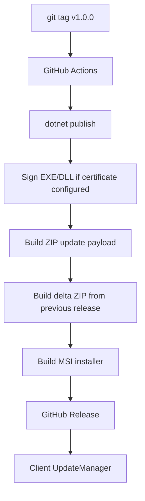
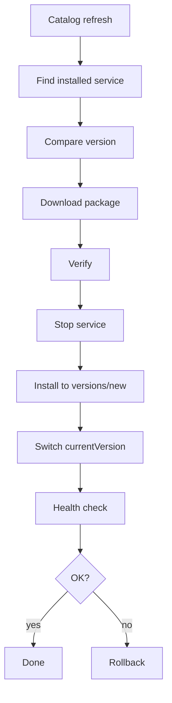

# 09 — Update & Release Plan

## Цель

Релизы приложения и сервисов должны идти через GitHub Releases, но пользователь должен получать обновления удобно и безопасно.

## Уровни обновлений

```text
Level 1: ExApp Desktop + Agent
Level 2: Installed Services
Level 3: Service Catalog
```

## App updates

Реализован собственный внешний `ExApp.Updater` + GitHub Releases. Desktop и Agent
поставляются как полный ZIP и как delta ZIP между предыдущим и новым app release.
Клиент выбирает delta ZIP, если установленная версия совпадает с `baseVersion`.
Delta содержит только измененные/новые файлы и список удалений. Updater применяет
файловый manifest, заменяет только нужные файлы, не трогает неизмененные, делает
backup затронутых файлов и откатывает их при неуспешном старте новой версии.
Для первичной установки выпускается per-user MSI installer с тем же payload.
Установка идет в `%LocalAppData%\Programs\ExApp`, чтобы updater мог менять файлы
без прав администратора.

Поток:



## App release checklist

- [x] DONE — добавить update check
- [x] DONE — добавить stable channel
- [x] DONE — добавить beta channel
- [x] DONE — настроить GitHub Actions
- [x] DONE — генерировать полный ZIP package
- [x] DONE — генерировать delta ZIP package
- [x] DONE — проверять SHA-256 и размер
- [x] DONE — обновлять Desktop и Agent через changed-file apply
- [x] DONE — создавать backup затронутых файлов и выполнять rollback
- [x] DONE — публиковать GitHub Release
- [x] DONE — добавить MSI installer
- [x] DONE — добавить signing pipeline hooks
- [ ] TODO — подключить production code-signing certificate
- [x] DONE — выбирать delta package при совпадении baseVersion

## Installer and signing

Локальная сборка installer:

```powershell
.\tools\package-exapp.ps1 -Configuration Release -Version 0.1.0
.\tools\build-exapp-installer.ps1 -Version 0.1.0
```

Production release должен быть подписан доверенным code-signing сертификатом.
GitHub Actions поддерживает `.pfx` через secrets:

```text
SIGNING_CERTIFICATE_BASE64
SIGNING_CERTIFICATE_PASSWORD
```

Чтобы запретить неподписанные app releases, включить repository variable:

```text
REQUIRE_CODE_SIGNING=true
```

## Service updates

Service updates не должны зависеть от обновления всего приложения.

Поток:



## Service release checklist

- [x] DONE — собрать service binaries
- [x] DONE — создать `.svcpkg`
- [x] DONE — сгенерировать checksums
- [ ] TODO — подписать package
- [x] DONE — загрузить в GitHub Releases
- [x] DONE — обновить `services.stable.json`
- [x] DONE — проверить catalog metadata
- [ ] TODO — подписать catalog
- [x] DONE — опубликовать catalog

## Channels

Сразу заложить:

- [x] DONE — `stable`
- [x] DONE — `beta` для приложения
- [ ] TODO — `dev`

## GitHub repositories

Рекомендуемый вариант:

```text
github.com/<owner>/exapp
  - основное приложение
  - исходники
  - app releases

github.com/<owner>/exapp-services
  - service packages
  - service releases

github.com/<owner>/exapp-catalog
  - services.stable.json
  - services.beta.json
```

Для MVP можно всё держать в одном mono-repo, но логически разделить папки.

## Versioning

Использовать SemVer:

```text
App:     0.1.0
Agent:   0.1.0
Service: 0.1.0
API:     1
Catalog: 1
```

## Release rules

- [ ] TODO — каждый app release имеет changelog
- [ ] TODO — каждый service release имеет changelog
- [ ] TODO — нельзя перезаписывать опубликованные версии
- [ ] TODO — нельзя менять package без изменения version
- [ ] TODO — нельзя публиковать package без sha256
- [ ] TODO — нельзя публиковать unsigned package в production
- [ ] TODO — rollback должен быть возможен минимум на одну версию назад

## Update UI

- [x] DONE — текущая версия приложения
- [x] DONE — текущая версия Agent
- [x] DONE — список установленных сервисов и версий
- [x] DONE — кнопка “Проверить обновления”
- [x] DONE — automatic update check toggle
- [x] DONE — channel selector
- [x] DONE — update history
- [ ] TODO — restart required state
