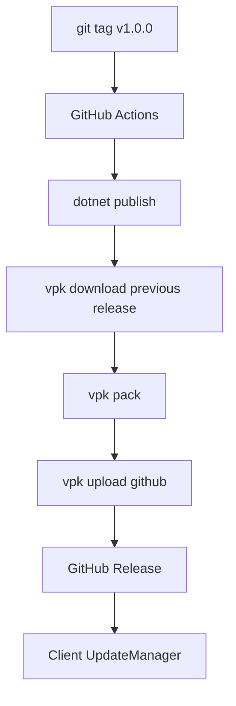
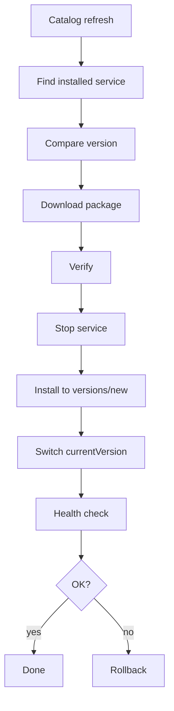

# 09 — Update & Release Plan

## Цель

Релизы приложения и сервисов должны идти через GitHub Releases, но пользователь должен получать обновления удобно и безопасно.

## Уровни обновлений

```text
Level 1: ExApp Desktop + Agent
Level 2: Installed Services
Level 3: Service Catalog
```

## App updates

Рекомендуемое решение:

```text
Velopack + GitHub Releases
```

Поток:



## App release checklist

- [ ] TODO — настроить Velopack
- [ ] TODO — добавить `VelopackApp.Build().Run()` в startup
- [ ] TODO — добавить update check
- [ ] TODO — добавить stable channel
- [ ] TODO — добавить beta channel
- [ ] TODO — настроить GitHub Actions
- [ ] TODO — генерировать installer
- [ ] TODO — генерировать full package
- [ ] TODO — генерировать delta package
- [ ] TODO — публиковать GitHub Release

## Service updates

Service updates не должны зависеть от обновления всего приложения.

Поток:



## Service release checklist

- [ ] TODO — собрать service binaries
- [ ] TODO — создать `.svcpkg`
- [ ] TODO — сгенерировать checksums
- [ ] TODO — подписать package
- [ ] TODO — загрузить в GitHub Releases
- [ ] TODO — обновить `services.stable.json`
- [ ] TODO — проверить catalog schema
- [ ] TODO — подписать catalog
- [ ] TODO — опубликовать catalog

## Channels

Сразу заложить:

- [ ] TODO — `stable`
- [ ] TODO — `beta`
- [ ] TODO — `dev`

## GitHub repositories

Рекомендуемый вариант:

```text
github.com/<owner>/exapp
  - основное приложение
  - исходники
  - app releases

github.com/<owner>/exapp-services
  - service packages
  - service releases

github.com/<owner>/exapp-catalog
  - services.stable.json
  - services.beta.json
```

Для MVP можно всё держать в одном mono-repo, но логически разделить папки.

## Versioning

Использовать SemVer:

```text
App:     0.1.0
Agent:   0.1.0
Service: 0.1.0
API:     1
Catalog: 1
```

## Release rules

- [ ] TODO — каждый app release имеет changelog
- [ ] TODO — каждый service release имеет changelog
- [ ] TODO — нельзя перезаписывать опубликованные версии
- [ ] TODO — нельзя менять package без изменения version
- [ ] TODO — нельзя публиковать package без sha256
- [ ] TODO — нельзя публиковать unsigned package в production
- [ ] TODO — rollback должен быть возможен минимум на одну версию назад

## Update UI

- [ ] TODO — текущая версия приложения
- [ ] TODO — текущая версия Agent
- [ ] TODO — список установленных сервисов и версий
- [ ] TODO — кнопка “Проверить обновления”
- [ ] TODO — auto-update toggle
- [ ] TODO — channel selector
- [ ] TODO — update history
- [ ] TODO — restart required state
